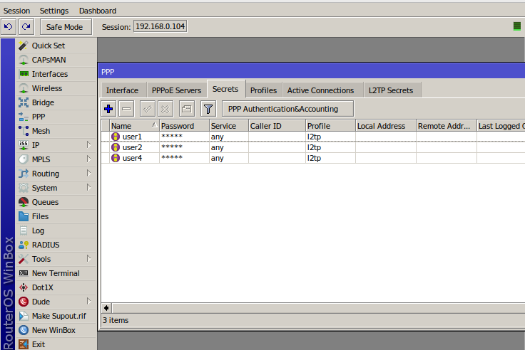

## _Description_

This playbook adds users for the l2tp vpn to the Mikrotik router and creates passwords for them. Usernames are stored in the vault.yaml.

Tested with Ansible 2.12.5

## _How to use_

- Set the router ip in the inv.yaml
- Put the vpn profile name and usernames in the vault.yaml
- Run: 
```sh
ansible-playbook -i inv.yaml routeros.yaml --ask-vault-pass
```
- Generated passwords are stored in /tmp/passwords/{{ username }}

Result example:




## _How to install MikrotiK Router on Ubuntu 20.04_

- Create script.sh file
```bash
vi script.sh
```
- Insert below all line into this file
```bash
#!/bin/bash
wget https://download.mikrotik.com/routeros/6.49.1/chr-6.49.1.img.zip -O chr.img.zip  && \
gunzip -c chr.img.zip > chr.img  && \
mount -o loop,offset=512 chr.img /mnt && \
ADDRESS=`ip addr show enp0s8 | grep global | cut -d' ' -f 6 | head -n 1` && \
GATEWAY=`ip route list | grep enp0s8 | cut -d' ' -f 9` && \
echo "/ip address add address=$ADDRESS interface=[/interface ethernet find where name=ether1]
/ip route add gateway=$GATEWAY
/ip service disable telnet
/user set 0 name=root password=xxxxxx"
echo u > /proc/sysrq-trigger && \
dd if=chr.img bs=1024 of=/dev/sda && \
echo "sync disk" && \
echo s > /proc/sysrq-trigger
```
- Setup executable permission on script file.
```bash
chmod 755 script.sh
```
- Run the script
```bash
sudo ./script.sh
```
- Reboot the VM
- Initial router credentials: login: admin, password: none